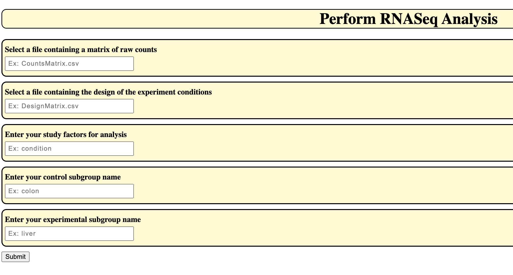
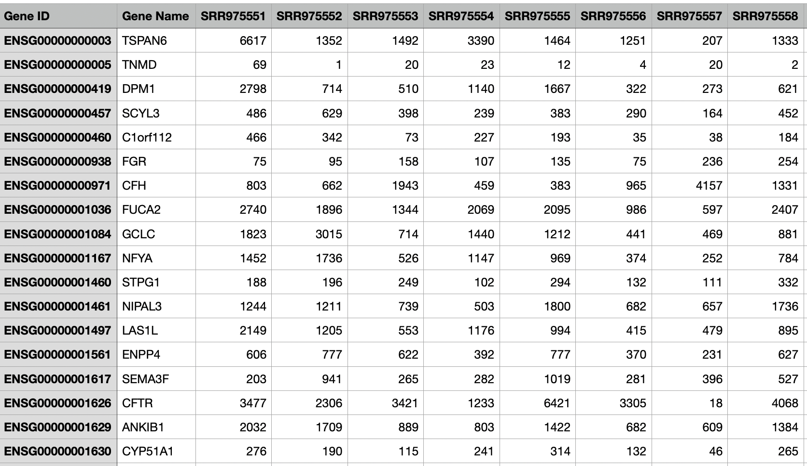
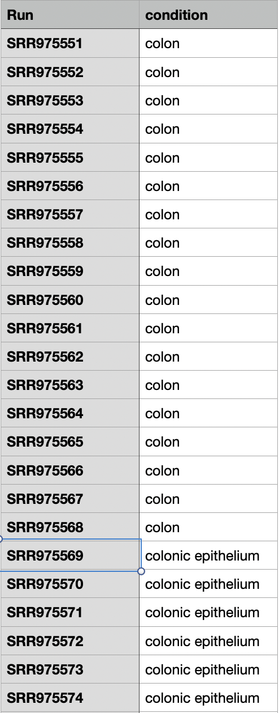

# Perform RNASeq Differential Expression Analysis

This program is intended to be accessed as a webpage on a server to perform RNASeq Differential Expression Analysis.
A combination of python, R, JQuery, HTML, and CSS are used to allow a user to query csv files containing RNASeq read
counts as well as a file containing study design parameters to determine differential expression between two 
user-specified groups. Differentially expressed genes are output to the html page and formatted for ease of visibility.

## Program Usage:

Prior to use, ensure that the csv file of read counts as well as the csv file containing study design information are
uploaded to the server and located in the Resources Folder. Additionally, the server hosting the web page should have
pandas, python, rpy2, R, Bioconductor, and DESeq2 installed. Program files should be organized in separate directories 
according to file type as they are here for proper referencing. User-provided input should match file names and columns 
exactly as written in the datasets.

To begin RNASeq analysis, visit the location of the RNASeq.html page on your web server:
```commandline
Example: bfx3.school.edu/user5/RNASeq/RNASeq.html
```

The following image shows the initial landing page the user sees when visiting the site. There, the user will enter 5
input variables corresponding to their desired analysis.
* .csv filename of RNASeq counts data
* .csv filename of study design information
* study factor of comparison during analysis
* control or reference subgroup name
* experimental subgroup name



Once the query is submitted, the complete list of results are displayed to the user in table format.

## .csv File Organization

Both .csv files should be organized in a specific format to ensure proper analysis.

The counts file should be arranged to have gene id's in the lefthand column with a header row for gene names and
different batch runs. Gene ID and Gene Name columns must be specified as listed in the picture below.



The .csv file containing study design information should act as the key to the different batch runs listed in the counts
file. There should be the same number of batch runs listed in each file and they should appear in the same order. The
format of the study design information should be similar to the picture below although additional columns can be added
if there are additional factors in the dataset.



## Project Layout

Description of files contained within RNASeq

* `RNASeq/:` The parent or "root" folder containing all the files within the program
    * `README.md:`
      This file! Contains instructions for how to use the program and a description of the package contents.
      
    * `img/:`
      Images used for this readme file - unnecessary for program execute
    
    * `Resources/:`
        Folder containing input .csv files for RNASeq analysis
      
    * `css/:`
      The folder containing all of the css assets used by the program
      
      * `RNASeq.css`
        css formatting for the results table that is displayed after submission of analysis query and html page
        
    * `js/:`
        Javascript assets used during program execution
      
      * `RNASeq.js:`
        This file contains the functions used to call the AJAX requests as users enter and submit data from the 
        html page.
    
    * `search.html:`
        The main html framework for the webpage document. Contains sections for the input section and the results table
      
    * `RNASeq.cgi:`
        Common Gateway Interface (CGI) file used to execute the user requests on the server using Python. AJAX requests sent from 
        the webpage by the user are processed through this file which queries the inputs from the csv files and
        returns the relevant results in a JSON format

### Author
    Conner Engle
    Last Updated: 3/20/2023
    IDE Used: Pycharm
    Python Version: Python 3.8
    
