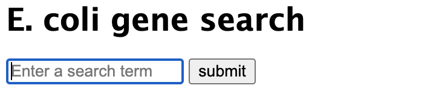
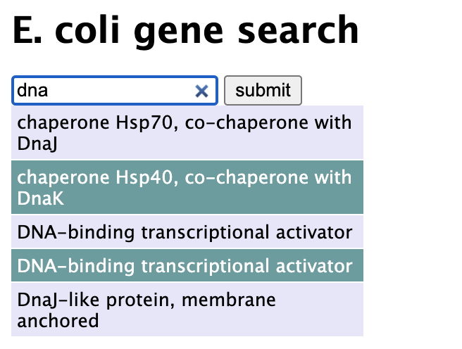
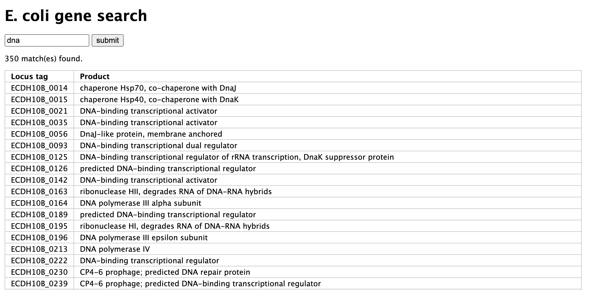

# Search Gene Products

This program is intended to be accessed as a webpage on a server containing a mySQL database of gene info to query.
A combination of python, JQuery, SQL, HTML, and CSS are used to allow a user to search the database by gene product
names. Any resulting matches are presented in table format showing the locus tag and gene product name. Autocomplete
functionality provides the first 5 results as the user searches to help them refine searches in real time.


## Program Usage:

Ensure that the program files are on a web server that can connect to your mySQL database of interest. MySQL connector
information found within search_product.cgi should be amended to connect with your database. The SQL query language may
need to be adjusted depending on the database layout. Program files should be organized in separate directories 
according to file type as they are here for proper referencing.

To begin searching for gene product information, enter the address of your search.html file on your web server:
```commandline
Example: bfx3.school.edu/user5/search_product/search.html
```

The following image shows the initial landing page the user sees when visiting the site. There, product names can be 
typed into the search bar to search for E. coli gene products.



As user input is entered into the search bar, the autocomplete function gives a limited sample of the search results
for that particular search.



Once the query is submitted, the complete list of results are displayed to the user in table format.




## Project Layout

Description of files contained within Search_Gene_Products

* Search_Gene_Products/: `The parent or "root" folder containing all the files within the program`
    * README.md:
      `This file! Contains instructions for how to use the program and a description of the package contents.`
      
    * Resources/:
      `Images used for this readme file - unecessary for program execute`
      
    * css/:
      `The folder containing all of the css assets used by the program`
      
      * searchResult.css
        `css formatting for the autocomplete results displayed to the user in real time as they type into the search bar`
        
      * search_product.css
        `css formatting for the results table that is displayed after submission of a search query`
        
    * js/:
        `Javascript assets used during program execution`
      
      * search.js
        `This file contains the runSearch(), processJSON(), and setText() functions used to query the SQL database and
        provide search results to the user through AJAX requests as they interact with the form. The submit and 
        autocomplete functions are housed in this file and execute once the document is loaded after entry into the 
        text box or clicking of the submit button.`
    
    * search.html
        `The main html framework for the webpage document. Contains sections for the search bar and the results table`
      
    * search_product.cgi
        `Common Gateway Interface (CGI) file used to execute the user requests on the server. AJAX requests sent from 
        the webpage by the user are processed through this file which queries the search term in the SQL database and
        returns the relevant results in a JSON format`

### Author
    Conner Engle
    Last Updated: 3/27/2022
    IDE Used: Pycharm
    Python Version: Python 3.8
    